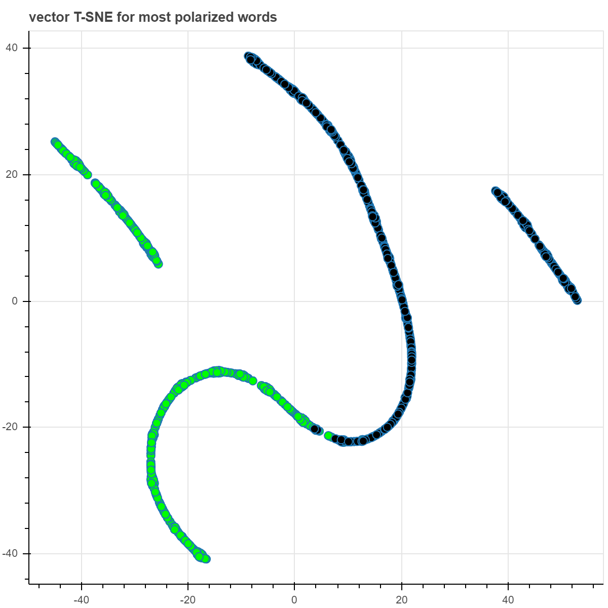
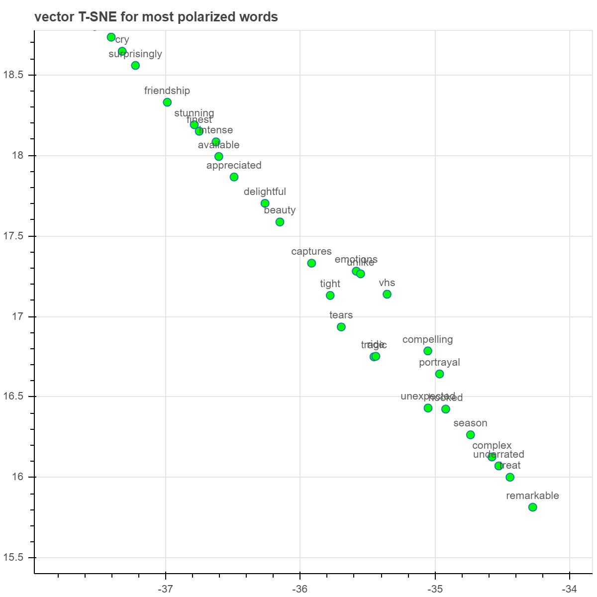
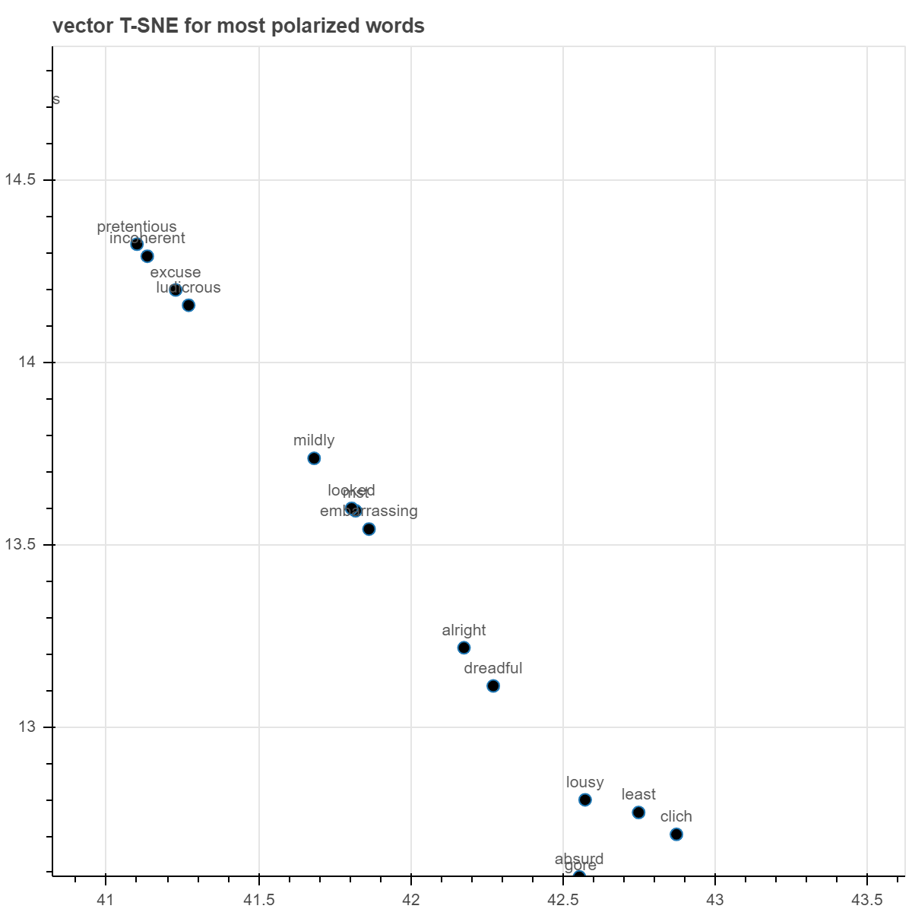

This is a project based on lectures by Andrew Trask made available through Udacity's [Deep Learning](https://www.udacity.com/course/deep-learning-nanodegree--nd101?utm_source=gsem_brand&utm_medium=ads_r&utm_campaign=8301633093_c&utm_term=85164669043_sa&utm_keyword=%2Budacity%20%2Bdeep%20%2Blearning_b&gclid=CjwKCAjw3-bzBRBhEiwAgnnLCoY40vok0vD2NW-hwfkFVG80e0M1AH0jXSMwqNPptU0n-URjm4PuthoCVFYQAvD_BwE) nano-degree. 

In this project, we implement a neural network to run sentiment analysis on imdb reviews using a bag-of-words model. 

The nueral network is implemented from scratch, including the forward and backward pass, without making use of any predifined neural network modules such as those provided in pytorch and tensorflow. 

A bunch of different techniques are then explored that help improve predicitons by cleaning up the noise in the data. 

We also implement better and faster techniques for the computations being performed by the neural net. The efficacy of these techniques is visible from the fact that while the neural net seemed to be processing ~ 200 reviews/sec  earlier, after the implementation of these techniques its speed got boosted to processing ~ 5900 reviews/sec during training. 

Further, dropping highly infrequent words and words with low polarity (in terms of positive or negative connotations) boosts the training speed to ~ 10600 reviews/sec with a minor loss in accuracy. 

These results demonstrate the high efficacy of the techniques being implemented here. 

In out model, the first hidden layer of neural net can be thought of learning word-embeddings for the words appearing in the corpus. We can therefore apply TSNE to visualize how the corresponding 2d vectors obtained from the word-embeddings cluster together. These are shown in the following graph:

Here the green colored points represent words associated with positive sentiments while the black colored words represent words associated with negative sentiments. We can see that the network has learnt how to group the words into 4 distinct clusters. 

The following a small section of the green cluster on the left:

Notice that some of the words in this cluster are: 'stunning', 'delightful', 'appreciated', 'compelling', 'remarkable' etc clearly indicating that the network has learnt that these words have similar connotation. 

Similarly, let's look at some of the words appearing in the right-black cluster:

The words in this cluster are: 'prententious', 'incoherent', 'ludicrous', 'dreadful', 'lousy' ... etc. Once again, we see that the network has learnt that these words belong to the category. 

We can similarly look at the words appearing in the green and black clusters in the center of the above graph. These are:

